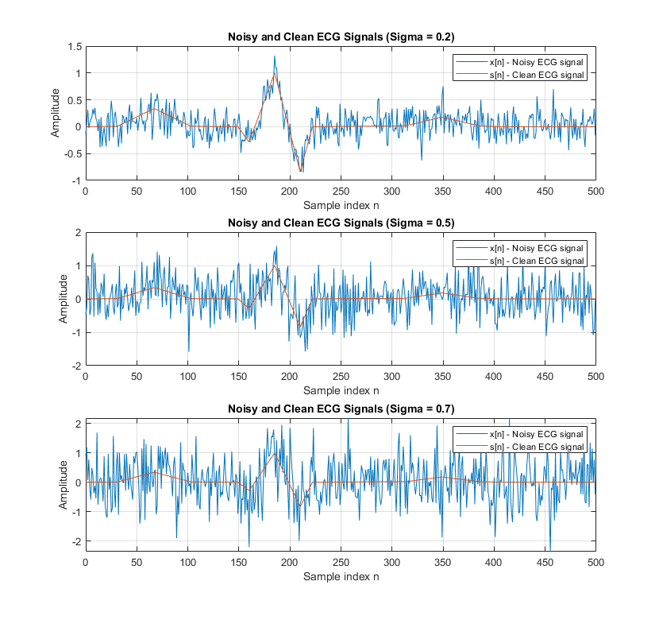
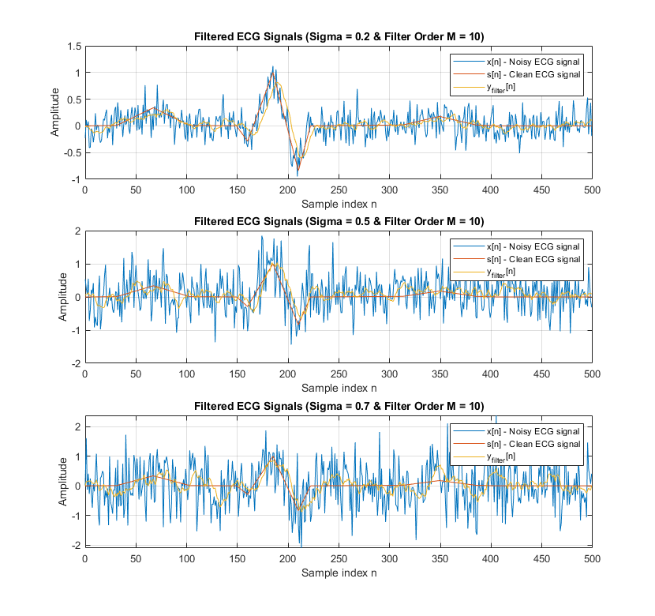
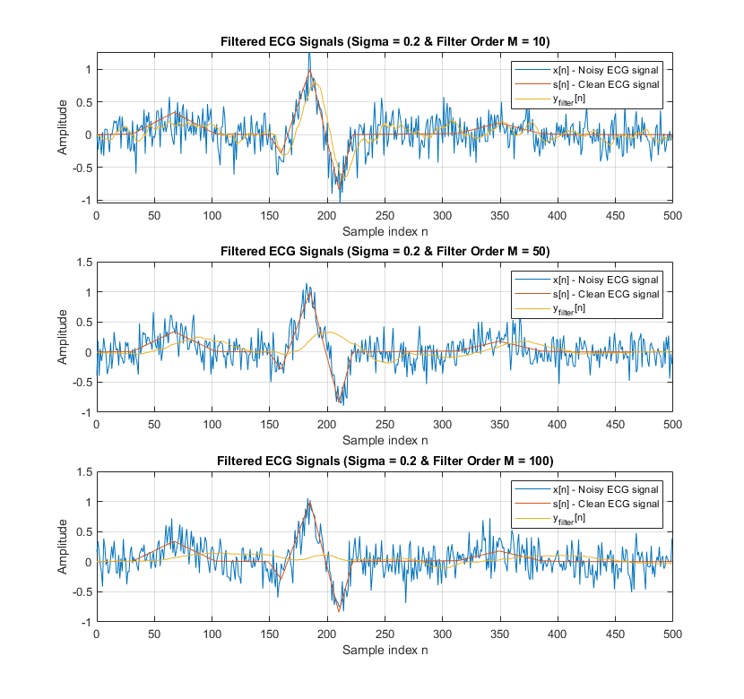
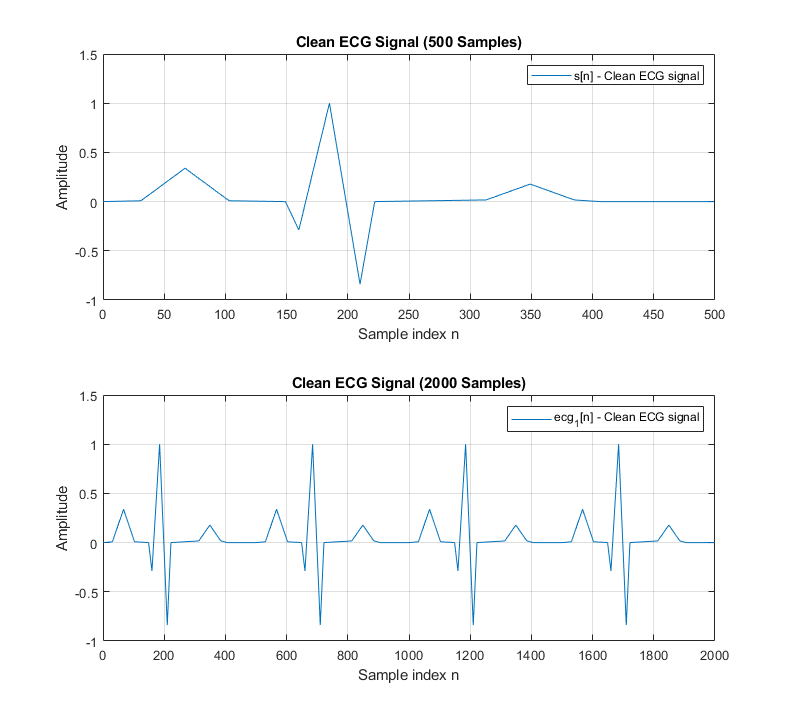
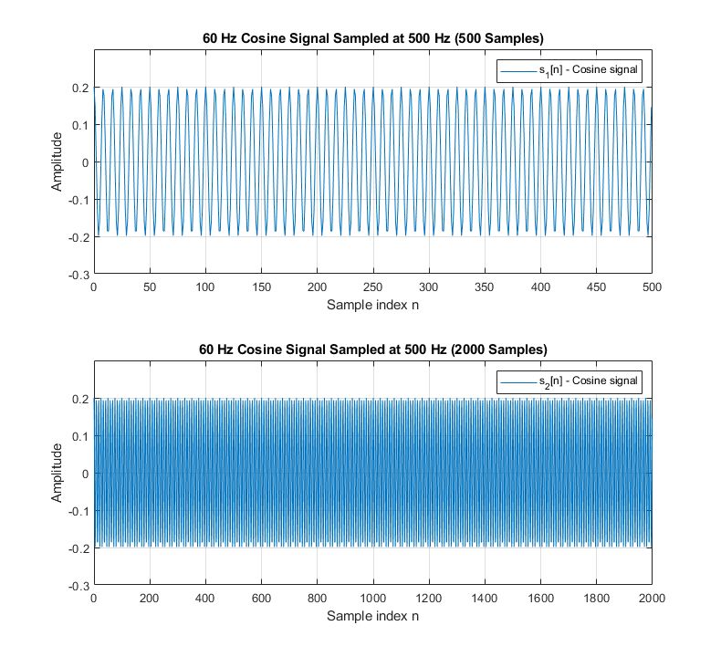
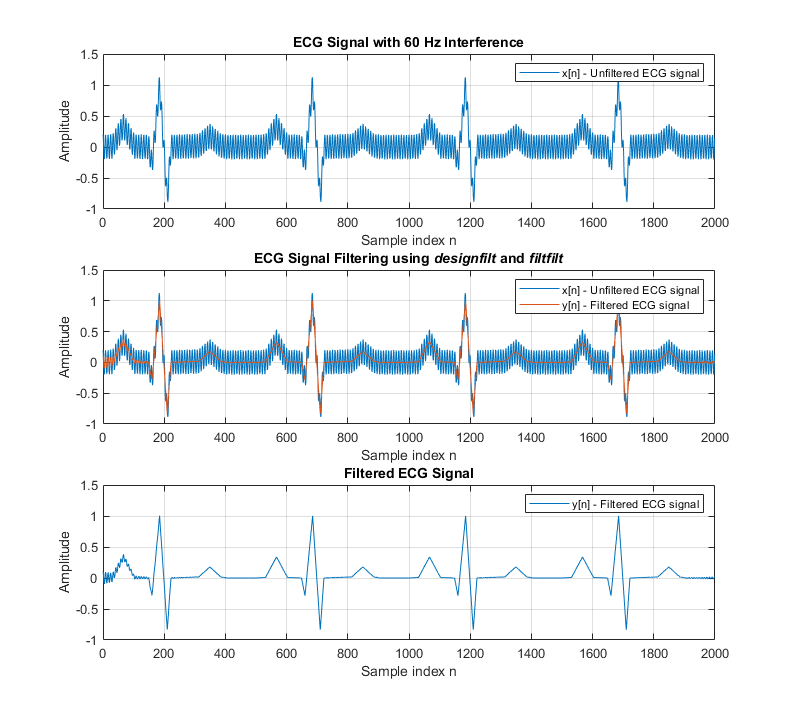
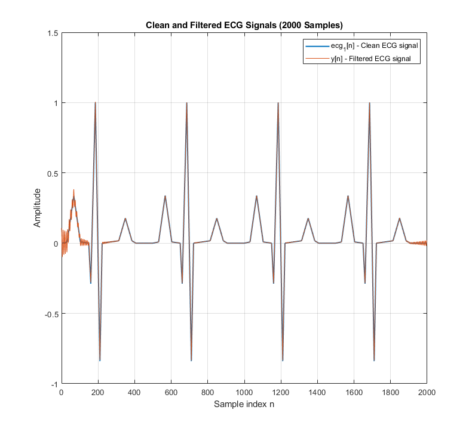

# ECG Signal
- Electrocardiography - The process of producing an electrocardiogram (ECG), a recording of the heart’s electrical activity through repeated cardiac cycles
- ECG records impulses to display how fast the heart is beating, rhythm of the heartbeats, and the timing of electrical impulses as they move through different parts of the heart
- Helpful device in medicine used to detect heart-related issues and other health conditions
- **Note:** Both projects (`Processing Bio ECG Signal` and `Filtering of an ECG Signal Corrupted by Power Supply Hum`) uses the same ECG signal generator MATLAB code[^1]

## Processing Bio ECG Signal[^2]
**ECG Signals, Functions, and Filtering Task**
- `ecg` - ECG signal generator to simulate ECG waveforms in MATLAB[^1]
- $x[n]$ - Input noisy ECG signal modeled as $x[n] = s[n] + sigma$, where sigma is $0<sigma<1$ and sampled at F<sub>s</sub> = 500 Hz
- $s[n]$ - Clean ECG signal
- $y_{filter}[n]$ - Output ECG signal using the MATLAB function `filter`
- **Task:** Reduce the noise fluctuations by filtering or processing $x[n]$ using a moving average Finite Impulse Response (FIR) filter of length $M+1$ by using the MATLAB function `conv`

### Moving Average Filter and Convolution
Adapted from M&I[^3], the moving average filter is expressed as:
  
$$
y[n] = \frac{1}{M + 1} \sum_{k=0}^{M} x[n-k],
$$
  
where $M$ is the filter order and $k$ is the index value, is used as a mathematical model to reduce the noise fluctuations from the noisy signal $x[n]$.

The moving average filter is defined by its impulse response $h[n]$:
  
$$
h[n] = 
\begin{cases} 
\frac{1}{M+1}, & \text{if } 0 \leq n \leq M \\
0, & \text{otherwise}
\end{cases}
$$

Linear time-invariant (LTI) systems can represented by the convolution sum:

$$
y[n] = x[n] * h[n] = \sum_{k=-&infin;}^{+&infin;} x[k]h[n-k]
$$

- Ex: $h[n] = [\frac{1}{3}, \frac{1}{3}, \frac{1}{3}]$ is linear and time-invariance
  - **Linearity:** For any scalar $a$, $S\\{ax[n]\\} = aS\\{x[n]\\} = ay[n]$.
        
    The output is $y_1[n] = \frac{1}{3} (x_1[n] +x_2[n-1] + x_3[n-2])$
    
  - **Time-invariance:** Consider the filter $y_1[n]$ above. For a delayed input $x_d[n] = x[n-d]$, the output is delayed by $y_d[n] = y[n-d]$.
    
    The output is $y_d[n] = y[n-d] = \frac{1}{3} (x[n-d] + x[n-d-1] + x[n-d-2]$

**Sigma Values and Filter Order $M$ Parameters**
- **Sigma:** 0.2, 0.5, and 0.7
- **Filter order $M$:** 10, 50, and 100
- Results were used to determine the ideal sigma values and filter order $M$ of ECG signals for detecting heart-related issues and other health conditions
  
### Results
***Noisy and Clean ECG Signals with Sigma = 0.2, 0.5, and 0.7***

  
***Noisy and Filtered ECG Signals with Sigma = 0.2, 0.5, and 0.7 with Filter Order M = 10***

  
***Noisy and Filtered ECG Signals with Sigma = 0.2 with Filter Order M = 10, 50, and 100***



## Filtering of an ECG Signal Corrupted by Power Supply Hum[^4]
**ECG Signals, Functions, and Filtering Task**
- $s[n]$ - Clean ECG signal
- $ecg_{1}[n]$ - Four ECG pulses of length 500 samples concatenated to create a 2000 samples long signal
- $s_{1/2}[n]$ - 500 and 2000 length 60 Hz cosine signal with 0.2 amplitude and 0 phase sampled at F<sub>s</sub> = 500 Hz, same as the signal $ecg_{1}[n]$ respectively
- $x[n]$ - Noisy ECG signal expressed as $x[n] = ecg_{1}[n] + s[n]$
- $y[n]$ - Output ECG signal using the MATLAB functions `designfilt`[^5] and `filtfilt`[^6]
- **Task:** Remove the 60 Hz interference from the noisy signal $x[n]$ by using a IIR notch filter

### Results
***Clean ECG Signals (500 and 2000 Samples)***

  
***60 Hz Cosine Signals Sampled at 500 Hz (500 and 2000 Samples)***


***60 Hz Interference and Filtered ECG Signals***
- A [bandstop filter of a 2 Hz bandwidth centered on 60 Hz](https://github.com/eoommaa/ECG-Signal/blob/debce32a187ec2d91e137edbedb090c0ae70d768/IIR%20ECG/irr_ecg.m#L83-L86) designed using the MATLAB function `designfilt` to remove 60 Hz interference

```matlab
% Filter the messy signal x[n] using 2nd order IIR notch filter of bandwidth = 2 Hz w/ 'designfilt'
d = designfilt('bandstopiir', 'FilterOrder', 2, 'HalfPowerFrequency1', 59, ...
    'HalfPowerFrequency2', 61, 'DesignMethod', 'butter', 'SampleRate', Fs);
```
  

  
***Clean and Filtered ECG Signals (2000 Samples)***



[^1]: ECG signal generator: MATLAB code [`ecg.m`](https://github.com/eoommaa/ECG-Signal/blob/c226983dcf1e0dbb263750cd5978ac46688e0c86/processing-bio-ecg/ecg.m)
[^2]: Processing Bio ECG Signal: MATLAB code [`processing_bio_ecg.m`](https://github.com/eoommaa/ECG-Signal/blob/main/Processing%20Bio%20ECG/processing_bio_ecg.m)
[^3]: D. G. Manolakis and V. K. Ingle, Applied Digital Signal Processing, 1st ed. Cambridge University Press, 2011, pp. 66–67.
[^4]: Filtering of an ECG Signal Corrupted by Power Supply Hum: MATLAB code [`iir_ecg.m`](https://github.com/eoommaa/ECG-Signal/blob/main/IIR%20ECG/iir_ecg.m)
[^5]: [MATLAB function `designfilt` documentation](https://www.mathworks.com/help/signal/ref/designfilt.html)
[^6]: [MATLAB function `filtfilt` documentation](https://www.mathworks.com/help/signal/ref/filtfilt.html)
